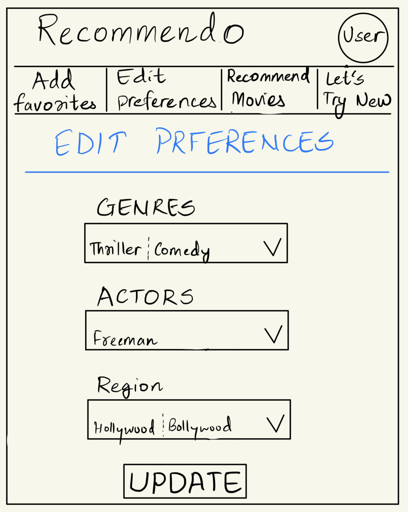

# Recommendo - explore movies from all over the world. 

## Overview
There are a lot of movies out there to watch. When your mate suggests you a movie saying it is the best they have ever seen, you know it might go either way. Instead of scrolling through endless recommendation of movies and hoping that you find something interesting, you should directly be able to watch the movie depending on your preferences. <u>**This is where Recommendo comes in.**</u>

Recommendo allows you to keep track of your watchlist, recommend new and popular movies from all across the world. Heck, if you want to try something different, it will help you choose that too.

## Data Model

The application will store User Information, Movies and People collections.

* User Information contains relevant information about the user.
* Movies contain information about the movie.
* Actor contains information about the Actor.

An Example User:

```javascript
{
  username: "Andy Dufresne",
  password: // a password hash,
  email: // list of favorite movies.
  genres: // list of favorite genres.
  recentlyWatched: // list of recently watched movies. { references Movie document}
  favorites: // list of favorite movie { references Movie document}
  people: //favorite actor or director for the User.
}
```
An Example movies document
```javascript
{
  movieId: //Unique identifier for the movie
  title: "Shawshank Redemption",
  release_date: // year of release
  overview: //description of the movie
  vote_average: //rating for the movie.
  genres: // genre associated with the movie
  posterPath: //poster for the image.
}
```
An Example Actors document
```javascript
{
    peopleId: //Unique identifier for the actor.
    name: "Morgan Freeman" ,//name of the actor.
    movies: //list of movies that the actor has featured in.
    image: //image associated with the person
}
```


## [Link to Commented First Draft Schema](db.mjs) 

## Wireframes

/ - homepage for the web app


/addFavorite - page for adding favorite movies


/edit - page for editing preferences such as genres and actors and region



/recommended - page for displaying recommendations based on preferences


/newpicks - page for displaying movies outside one's favorites.


## Site map


## User Stories or Use Cases

1. As non-registered user, I can register a new account with the site
2. As a user, I can log in to the site
3. As a user, I can update my preferences based on genres and actors.
4. As a user, I can view new releases based on my preference

5. As a user, I can view recommendations based on my preferences.

## Research Topics

* (2 points) Include some sort of movie API to get the data.
  * I am looking to include some kind of movie API to query the movie and store it in the database. I will not be storing all of the movies in the database.
* (4 points) Perform client side validation using jQuery.
  * I want to perform client-side form validation using jquery plugin.
* (4 points) Recommendation algorithm.
  * I am looking into implemeting some sort of recommender system that recommends movies to the user.
* (2 points) Include Boostrap for Css framework
  * I have edited and included bootstrap for css framework.

## [Link to Initial Main Project File](app.mjs) 

## Annotations / References Used


1. [movies database](https://rapidapi.com/SAdrian/api/moviesdatabase/) - Api that I plan on using for this project.
2. [Recommendation systems](https://www.nvidia.com/en-us/glossary/data-science/recommendation-system/) - Article on recommendation systems.
